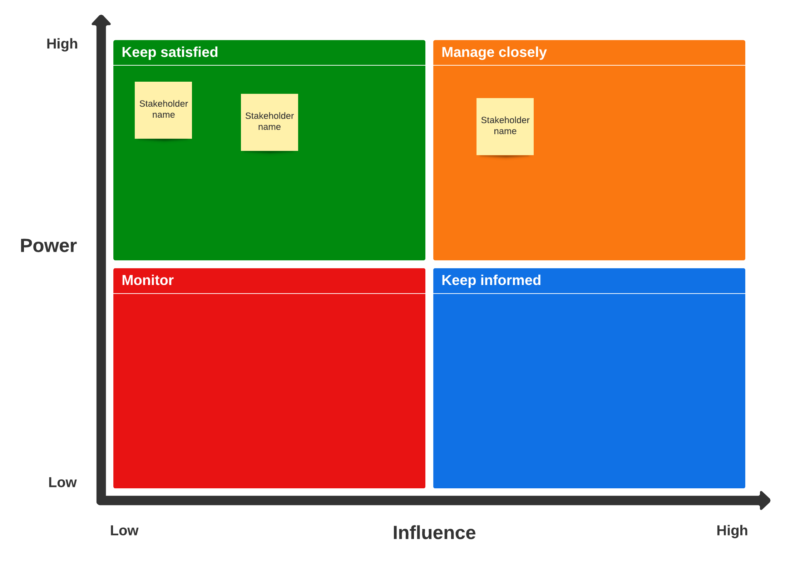

# Session 2: 🔤 Community of Practice Basics

**DRAFT PRE-ALPHA VERSION FOR ONLINE WEBPAGE**

> *As a community, great things can happen when each individual contributes, according to their strengths, toward a common goal.* ― Idowu Koyenikan

## Key lessons
- Purpose and outcomes of your community 
- Creating a stakeholder map
- Developing roles and responsibility documentation 
- Community communication channels

## 🖥 Part 2.1: Mapping Stakeholders and their engagement needs

[**Link to the Google Slides**](https://docs.google.com/presentation/d/18kxCLkNEZBVfZ-IBMkE_Un0W67MBoEPbGabygMvqeRY/edit#slide=id.g13faa93073d_0_111)

### Let's first start by reflecting on these questions

* Why invest in community building?
* What are some good examples of community building have you experienced?

### **Purpose and outcomes**

*Each participant can create a table to add details from their projects.*

| **Project/subproject Names** | **Purpose** | **Outcomes** |
| --- | --- | --- |
| | | |
| | | |
| | | |

### **Identifying Stakeholders**

| **Contributors** | **Role** | **Nature of participation** |
| --- | --- | --- |
| | | |
| | | |
| | | |

### **2.2 Optional for projects with many stakeholders: Prioritising Stakeholders**

[**Link to the Google Slides**](https://docs.google.com/presentation/d/1BO-_VtRL-WrcpoEzSv_4ZCcEEg8QaZepeRGx6rB9grQ/edit#slide=id.g1072083f421_1_0)

Anybody who can affect or is affected by an organisation, project, community or the processes and strategy they use.
Identifying who they, how they engage and what they need to affect changes is crucial for the success of a project.

**Template for the Community Management at the Turing**

[Extanded Miro Board for Stakeholder and Communication/Engagement Mapping](https://miro.com/app/board/uXjVMWzhGGc=/?share_link_id=996948844923)

**Find general templates for reuse:**

- Lucidparks: [https://lucidspark.com/blog/a-guide-to-stakeholder-mapping](https://lucidspark.com/blog/a-guide-to-stakeholder-mapping)
- Mural: [https://www.mural.co/templates/stakeholder-mapping](https://www.mural.co/templates/stakeholder-mapping)
- Miro: [https://miro.com/templates/stakeholder-map/](https://miro.com/templates/stakeholder-map/)

### **2.3 Resources and engagement/communication platforms**

**Resources and infrastructure:**

- Tools/platforms:
- Documentation:
- Infrastructure:
- Events:
- Opportunities: 
- Agency and decision-making power: 
- [Anything else?]

**Types of engagement:**

- Primary: GitHub
- Asynchronous: Newsletter, talks, Slack, Twitter, documentation
- Synchronous: Co-working calls, Collaboration Cafe, Book Dash
- *Let's discuss the other types of engagements you have implemented ...*

## 📝 **Assignment 2 + Discussions:** 

[2 - Community of Practice Basics](https://docs.google.com/document/d/1r08Yu2tG8DcOiMpF6bbHrlgMRdePNxlWSRd3tvK7fcQ/edit?usp=sharing) **← [MAKE A COPY]**

1. What is the purpose of your CoP or project? What are the main and expected outcomes of the project?
2. Who are your stakeholders and what are their roles?
3. How do you facilitate their participation, collaboration and contributions - what are the engagement and communication platforms?

**Reading recommendation**

- Research culture: let's reimagine how we work together: [https://wellcome.org/what-we-do/our-work/research-culture](https://wellcome.org/what-we-do/our-work/research-culture)

**Note:**

* The assignments from this session is for you to come back to, update and reflect on periodically, such as in the mid-year or annual review.
* You can exchange this with other community managers to get some feedback.

## 🏡 Key takeaways

In this session, we discussed:

* How to map the purpose and outcome of your community
* How to map stakeholders and their engagement in the project
* how to enable that engagement through appropriate communications tools, channels and platforms
